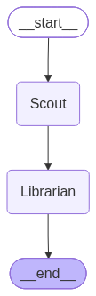

# 🛡️ Sentinels of Truth

### Automated AI Fact-Checking & Knowledge Management

**Sentinels of Truth** is a multi-agent AI system that autonomously investigates real-world claims against live web evidence and reconciles the verdicts against a persistent ground-truth database. Two specialized LangGraph agents — an investigative **Scout** and a database-gatekeeping **Librarian** — collaborate in a directed pipeline to verify, debunk, and flag conflicting information in real time.

---

## 🧠 The Architecture (Multi-Agent System)

<p align="center">
  
</p>

The system is orchestrated as a directed graph of two cooperating agents, each with a narrow, well-defined responsibility — a design that keeps reasoning (Alpha) cleanly separated from state mutation (Beta).

### 🔎 Agent Alpha — *"The Scout"*
The investigative front-line agent. Alpha receives a raw claim, performs a **Tavily web search** to gather current evidence, and passes that evidence to a **Groq-hosted Llama 3.1 8B** model constrained with `.with_structured_output()`. This forces the LLM to return a strict Pydantic-validated `VerificationReport` — containing a verdict (`VERIFIED` / `FALSE` / `UNVERIFIED`), a confidence score, a plain-English summary, and a normalized `subject` field used downstream for database matching.

### 📚 Agent Beta — *"The Librarian"*
The gatekeeper. Beta takes Alpha's report and reconciles it against the SQLite `claims` table using a deterministic conflict-resolution policy:

| Scenario | Action |
|---|---|
| Claim is `UNVERIFIED` | **Discard early** — never touches the database |
| No existing record for the subject | **Insert** (`VERIFIED` or `FALSE`) |
| Existing record agrees, or is already `FLAGGED` | **Discard (Redundant)** |
| Existing record contradicts the new verdict | **Flag (Pending Review)** — appends a timestamped conflict note and merges source lists |
| Concurrent insert collides on the unique `subject` constraint | **Discard (Concurrent Duplicate)** — caught via `sqlite3.IntegrityError` |

### 🕸️ The Orchestrator
**LangGraph** wires Alpha and Beta together through a shared `AgentState` TypedDict — the system's "scorecard." State fields like `claim`, `subject`, `report`, and `beta_action` flow through the graph, while `trace` uses an `operator.add`-annotated reducer so every node appends to a running audit log instead of overwriting it. The graph itself is a simple, explicit pipeline: `START → Scout → Librarian → END`.

---

## ⚙️ Tech Stack

- **FastAPI** — REST API layer exposing the verification endpoint
- **Streamlit** — interactive frontend for submitting claims and viewing verdicts
- **LangGraph** — stateful multi-agent orchestration
- **Groq + Llama 3.1 8B (Instant)** — low-latency structured-output inference for Agent Alpha
- **Tavily Search API** — real-time web evidence retrieval
- **SQLite** — lightweight persistent ground-truth store
- **Pydantic** — schema validation for both LLM output and API contracts
- **python-dotenv** — environment/API key management

---

## 🚀 Local Setup & Installation

**1. Clone the repository**
```bash
git clone https://github.com/<your-username>/sentinels-of-truth.git
cd sentinels-of-truth
```

**2. Create and activate a virtual environment**
```bash
# Create the venv
python -m venv venv

# Activate it
# macOS / Linux
source venv/bin/activate
# Windows
venv\Scripts\activate
```

**3. Install dependencies**
```bash
pip install -r requirements.txt
```

**4. Configure environment variables**

Create a `.env` file in the project root with your API keys:
```env
GROQ_API_KEY=your_groq_api_key_here
TAVILY_API_KEY=your_tavily_api_key_here
```

**5. Run the system — two terminals required**

This is a two-process system: the FastAPI backend and the Streamlit frontend run independently and communicate over HTTP.

> **Terminal 1 — Start the backend API**
> ```bash
> uvicorn main:api --reload
> ```
> This also initializes `ground_truth.db` on first run.

> **Terminal 2 — Start the frontend**
> ```bash
> streamlit run frontend.py
> ```

Once both are running, open the Streamlit URL (typically `http://localhost:8501`) and submit a claim to watch the Scout and Librarian go to work. 🕵️‍♂️📖

---

## 🔬 System Limitations & Future Architecture

The current implementation exposes a fundamental architectural tension: **a probabilistic reasoning layer writing into a deterministic storage layer.** Agent Alpha's `subject` field is generated by an LLM to normalize a claim's topic for deduplication — but Agent Beta resolves conflicts via an exact-match SQL `WHERE subject = ?` query against a `UNIQUE` constraint. Since LLM generation is non-deterministic across calls, semantically identical topics can be phrased differently between runs. A concrete edge case surfaced during testing: the claim *"Jupiter is the largest planet"* can yield the subject `"largest planet"`, while a related claim like *"Saturn is the largest planet in our solar system"* yields `"largest planet in our solar system"`. These are the same underlying fact-space to a human, but to SQLite's string comparison they are two unrelated rows — silently defeating the conflict-detection logic the Librarian depends on. This is a structural ceiling of exact-match relational lookups for anything derived from generative text, not a bug fixable with better prompting alone.

The next architectural evolution addresses this by replacing (or augmenting) the SQLite exact-match lookup with a **vector database** — such as **ChromaDB** — that embeds each `subject` string and retrieves near-duplicate claims via **cosine similarity** against a tunable threshold, rather than string equality. This would let the Librarian correctly cluster `"largest planet"` and `"largest planet in our solar system"` as the same semantic subject, enabling true fuzzy conflict detection while preserving SQLite (or a hybrid store) for the structured, auditable fields — status, confidence, timestamps, and source provenance.

---

## 📂 Repository Structure

```
sentinels-of-truth/
├── main.py              # FastAPI app — exposes POST /api/verify, invokes the LangGraph orchestrator
├── orchestrator.py       # LangGraph StateGraph — wires Scout → Librarian → END, compiles the app
├── alpha_agent.py         # Agent Alpha ("The Scout") — Tavily web search + Groq structured-output verification
├── beta_agent.py           # Agent Beta ("The Librarian") — SQL conflict resolution (Insert / Flag / Discard)
├── database.py               # SQLite schema definition and DB initialization (claims table)
├── frontend.py                 # Streamlit UI — submits claims to the API and renders verdicts + trace history
└── requirements.txt              # Python dependencies
```